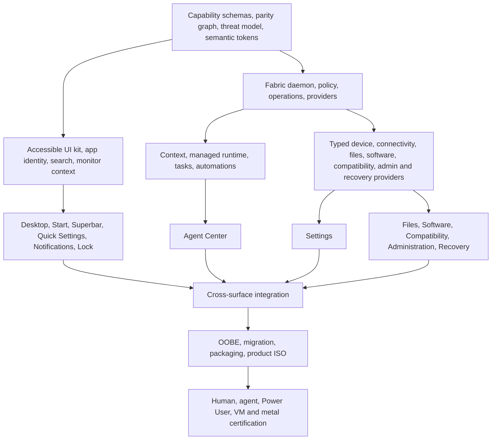

# Ultimate Product Completion Program — 2026-08-26

This is the next major Project Ultimate program. It supersedes stale next-work ordering and current-status prose in `plans/project-ultimate.md` and `HANDOFF_NEW_BOX_2026-08-23.md`, while leaving every immutable handoff and historical W0 record untouched as evidence.

It is one dependency-managed program spanning the remaining Agent Fabric, design system, desktop shell, Settings, Files and defaults, Software, Windows compatibility, administration and recovery, OOBE and migration, and release certification work.

The locked identity remains:

> **Windows 7 Ultimate's complete, obvious, mouse-native desktop model rebuilt for 2026, with an agent-native operating fabric underneath every system capability.**

The product remains **REJECTED** until all six Release verdict conditions pass at one packaged candidate SHA. The Windows-native, parity, and agent-native matrices are the three core product proofs inside that larger release contract; completing one wave, one application, or one attractive shell surface does not change the verdict.

## Reconciled starting point

This program starts from a clean, independently audited baseline:

- `work`, local `HEAD`, GitHub `origin/work`, and the metal checkout are exactly `1334ba3098d351be9ef4687c0d9db5a99f88f617`.
- `main`, `origin/main`, and live `upstream/quattro` are exactly `0ae1694830b6bd9511042fe1b89a0062d8c083cb`.
- Local and GitHub branch heads are exactly `main` and `work`. The rebased backup branches, redundant local tag, and zero-unique metal stashes were audited and removed.
- All 66 official tags match origin and upstream. Aider histories and historical evidence were deliberately retained.
- Chrome CSD geometry is closed on the 1920×1080 metal box: fresh float and restore paint exactly 1,200 visible pixels, native maximize and F11 paint all 1,920 pixels, repeated transitions do not drift, the physical right edge and caption controls are visible, and focus IPC is honest. Future native-chrome changes must preserve that measured baseline.
- Focused WindowService, Chromium CSD, and native plugin suites pass. The aggregate metal run has five unrelated existing/environment failures; the local WSL aggregate is dependency-contaminated, while all changed-area focused suites are green. Baseline-suite repair belongs in this program and must not be confused with a Chrome regression.
- The Desktop Mode overlay still must not rewrite `~/.config/omarchy/shell.json`. `main` remains an exact upstream mirror; all Ultimate implementation stays on `work`; no slice branches are allowed.

## Program exit state

This program is complete only when the machine is a coherent consumer-owned operating product rather than a set of mature plumbing components behind shell panels.

At exit:

- Every meaningful human operation resolves through one machine-readable capability graph and the same typed provider path available to agents.
- A durable per-user Fabric control plane owns user-scoped principals, policy, approvals, operations, recovery, context, tasks, automations, events, artifacts, and managed agent execution. A root-journaled system executor is authoritative for machine-scoped privileged operations. Quickshell is a client and session provider, not the authority for either class of durable work.
- One resolved semantic token pipeline drives QML surfaces, Superbar, hyprbars, caption buttons, dark/light themes, density, accessibility, and motion.
- Desktop, Start, Superbar, previews and jump lists, Task View, Quick Settings, Notification Center/calendar, lock, Agent Center, and Settings behave as one monitor-aware shell.
- Settings is a normal application over typed Display, Audio, Network, Bluetooth, Input, Personalization, Apps/defaults/startup, Power, Accessibility, Update, Recovery, and system-information providers.
- Files/This PC/Desktop/Trash/default applications/removable media/SMB are consumer-complete, with Dolphin/KIO/Solid used as component plumbing and no loss of existing LocalSend or transcode jobs.
- Software Center unifies curated packages, signed repositories, Flatpak, reviewed AUR, managed AppImage, web apps, and installed-state adoption with trust, preflight, progress, history, safe removal, and recovery.
- Compatibility Center routes Windows software through native, PWA, known-good recipe, game/Proton, genuinely isolated application, or VM paths and owns adoption, permissions, lifecycle, export, and safe removal.
- Task Manager, Devices and Printers, Storage, Accounts, Firewall and Sharing, Update, Restore Points, Backup, Privacy, Credentials, and Troubleshooting expose the existing system machinery through consumer surfaces.
- Graphical OOBE, migration, deferred-owner setup, factory reset, packaging, and product ISO use the same validators and operation model. The ordinary first-run path teaches visible Start, Files, Settings, Software, Restore, and Agent Center—not a terminal or memorized hotkeys.
- Accessibility, localization, mixed-DPI/multi-monitor behavior, performance, failure states, security, migrations, rollback, and fresh-package behavior are release gates, not later polish.
- The forty-task Windows-native test, complete parity graph, paired agent-native matrix, and Power User Mode regression all pass on a packaged candidate.

## Architecture commitments

### Durable Fabric control plane

Build a versioned local control plane named `omarchy-fabricd`, initially as a Python 3 user daemon using stdlib SQLite and fixed-argument process execution. Python is already a runtime invariant; the RPC and schemas remain language-neutral so the implementation can later move without changing clients.

The authoritative user-scoped Fabric state is `~/.local/state/omarchy/fabric/fabric.db` in SQLite WAL mode. The owner-only transport is `$XDG_RUNTIME_DIR/omarchy/fabric.sock` using versioned newline-framed JSON RPC. Durable task artifacts live under `~/.local/share/omarchy/fabric/artifacts/`. Secrets remain in Secret Service and enter a run through file descriptors or short-lived credentials, never argv, prompts, ordinary files, logs, or the ledger.

Owner-only socket credentials establish the operating-system UID, not a trusted UI, provider, agent, or undo role. Fabric issues endpoint/session bindings for provider and task roles, and a caller can never gain one by supplying an actor string. While third-party QML still executes in the Quickshell process with the shared `shell` object, the entire shell—including installed plugin code—is one principal: it receives no standing consequential or high-risk grant, and consequential shell-origin requests require per-operation consent. Same-UID malware limitations are stated honestly; managed task sandboxes receive a task-scoped proxy rather than the main user socket.

Quickshell uses one reconnecting Fabric client and a provider bridge. WindowService remains the first session provider and retains an emergency human-only fallback so caption controls cannot trap the user if the daemon is unavailable. Agents never receive that fallback. Fallback actions append to an atomic offline journal containing UUID/idempotency key, normalized action, state snapshot, result, and replay status; reconnect reconciliation proves torn-write recovery and exactly one durable operation. Until plugin isolation lands, same-process third-party QML can also reach direct WindowService, which is why plugin isolation is a prerequisite to the final Fabric security gate.

### Durable system execution plane

A minimal root-owned, package-installed system executor owns package transactions, firmware, partitioning, accounts, firewall, factory reset, and every system job that must survive logout/reboot or be visible across administrators. It keeps the authoritative root journal under `/var/lib/omarchy/fabric/`, exposes fixed versioned typed operations with stable IDs, checkpoints, progress, reconnect, reconciliation, cancellation limits, and recovery, and accepts no arbitrary executable, shell string, or user-controlled helper path.

User Fabric proposes, authenticates, observes, and links to system operations; it never holds their only authoritative state. The system executor independently validates the exact operation, target identity/state fingerprint, policy, and dedicated Polkit authorization immediately before mutation. Per-user ledgers retain redacted links to shared system jobs, while visibility and control across administrators follow explicit policy.

### Capability and parity graph

Ship versioned domain manifests under `default/ultimate/capabilities/`, schemas under `default/ultimate/capability-schema/`, and the job graph under `default/ultimate/parity/jobs.json`.

Every capability descriptor contains a stable ID, provider/version, input/state/result/error/preflight/progress/undo schemas, availability, reader/writer/long-running classification, effect tags, resource scopes, consent policy, idempotency and concurrency rules, cancellation and recovery rules, redaction, visible human route, Agent Center label, and acceptance/parity proof IDs.

Every Windows parity job resolves to one or more capability IDs, a visible human route, agent availability, recovery expectations, and automated/VM/metal proof. The first inventory records every current mutation in a checked legacy-debt manifest with states such as `legacy-direct`, `provider-missing`, and `agent-unavailable`. Validation rejects new unregistered debt, dishonest availability, an agent-only mutation without a human affordance, a destructive operation without preflight/recovery metadata, or documentation that claims `present` without proof; it allows only the explicitly enumerated migration baseline until provider conversion removes it.

The existing broker is only a prototype: it catalogs 21 WindowService verbs while 18 additional public or IPC writer paths bypass the catalog, trusts caller-supplied actor labels, and stores a 200-row ledger with no operation identity or lifecycle. Do not extend that switch statement into the OS architecture.

### Operation, approval, and recovery model

Every mutation is an operation with a durable identity, an explicit `changeState` of `none | partial | complete | unknown`, and a lifecycle that separates interruption from truth:

```text
proposed → awaiting-consent/authentication → queued → running
         → validating → succeeded | failed | cancelled | interrupted
timed change: validating → awaiting-keep → succeeded | rolling-back → rolled-back | rollback-failed
restart work: validating → waiting-restart | waiting-reboot → reconciling → succeeded | failed | needs-attention
interrupted → reconciling → succeeded | failed | needs-attention
eligible operation → undoing | recovering → undone | undo-failed | recovered | recovery-failed
```

Every operation records operation, correlation, transaction, task, and run IDs; the endpoint-bound principal; capability and provider versions; normalized redacted arguments; preflight; current-state revision; progress; result/error; change state; checkpoints; artifacts; recovery; and separate undo/recovery eligibility fields. Lifecycle status never encodes whether change was none, partial, complete, or unknown. Approval binds the normalized arguments, provider version, state revision, and expiry; drift forces a new preflight. High-risk operations never receive persistent automation grants.

Preflight translates consequences before execution: current state, exact proposed changes, estimated time/download/build/disk use, destructive/irreversible flags, privilege, network, AC, logout/reboot, cancellation limits, and recovery path. Consent and Polkit authentication remain separate decisions. Providers validate post-apply state; timed changes such as display configuration survive shell/daemon failure, persist the keep deadline, and automatically roll back unless the user confirms. Restart/reboot-pending operations remain durable and reconcile after the required transition.

Undo is one-shot, eligibility-scoped, expiry-aware, and guarded by a target-state fingerprint. The product distinguishes true undo, a compensating action, a restore point, and instructions for manual recovery. Repeated `undoLast()` against stale state is removed.

Privileged GUI and agent operations enter the system executor through capability-specific Polkit actions; there is no second generic helper or journal path. The executor independently validates the fixed action, normalized arguments, current machine state, and authorization; an approval nonce correlates consent and audit but is never an authorization boundary against same-UID code. It never accepts a shell string, user-controlled executable, or checkout path. Terminal-origin heritage commands continue to use `sudo` according to repository privilege doctrine.

### Persistent tasks, automations, context, and managed agents

Fabric owns persistent task, run, step, automation, trigger, context snapshot, permission, approval, operation, artifact, usage, and provider-health records.

Task lifecycle is `draft → awaiting-approval → queued → running → waiting/retrying → succeeded | failed | cancelled | interrupted`. Tasks run only while the user is signed in by default. Each automation declares missed-run behavior, coalescing, time-zone/DST behavior, concurrency, retry, and time/cost limits. User lingering is an explicit disclosed opt-in for tasks that must run while signed out. Startup, login, reboot, clock rollback, and provider-version changes reconcile interrupted operations and missed schedules without guessing that consequential work changed nothing; multiuser state, sockets, grants, and databases remain isolated per UID.

Context is requested, scoped, snapshotted, visible, revocable, and labeled with source, capture time, TTL, revision/hash, sensitivity, redaction, and access scope. Sources include windows/desktops, explicit file selections, focused application metadata, current product route, system state, notifications/history, and user-attached files or screenshots. Lock screens, password fields, Polkit prompts, browser credentials, keyring data, and private notifications are excluded by default.

Managed agent runs use bubblewrap plus a systemd transient scope, explicit workspace/artifact mounts, task-scoped Fabric proxy, resource/time/output/cost budgets, and reliable cancellation. They receive no general home directory, Wayland socket, session bus, SSH agent, browser profile, keyring, or main Fabric socket. Network is disabled unless explicitly granted. Missing sandbox prerequisites fail closed; there is no silent unsandboxed fallback.

The existing `omarchy-agent` terminal launchers remain explicitly legacy-interactive and outside managed tasks/automations. The current `omarchy.agents` usage widget remains visible until Agent Center absorbs its providers, limits, cost, token, and activity data.

### Unified design, surface, search, and application identity contracts

Generate one versioned resolved token payload from theme colors and shell overrides. It covers semantic surfaces, text, accent, selection, state, focus, borders, caption roles, typography, icons, hit targets, density, radii, elevation, blur/shadow, motion, reduced motion, high contrast, and component metrics. QML and native/Lua chrome consume this payload. Legacy `chrome-tokens.json` remains an adapter for one compatibility window, not the source of truth.

Every shell invocation carries the invoking screen identity, connector/EDID, anchor rectangle, pointer/keyboard seat, requested route, and focus-restoration target. Replace global transient assumptions with deterministic monitor-aware ownership while preserving proven Start click-through.

One search result contract serves Start, Settings, desktop, Files, Software, and Agent Center. Results carry stable identity, source, title/subtitle/icon, typed action, secondary actions, trust/destructive markers, route, and local ranking metadata. No web-result hijacking.

One normalized application identity joins desktop entries, compositor windows, icons, pins, recent items, notifications, badges, progress, jump lists, installed-app records, and agent tasks.

Third-party QML is currently unsandboxed full-session-trust code in the same process as first-party shell UI. During transition the whole shell is treated as one principal, installed plugins are labeled honestly, and no standing consequential or high-risk grants are issued to that principal. The final Fabric security gate requires third-party code to move into a separate host or a declarative widget model with a scoped broker connection.

### Standalone product application boundary

Settings and Agent Center are separate application processes, not shell-loaded layer surfaces. Their sources live under `shell/apps/ultimate-settings/**` and `shell/apps/ultimate-agent-center/**`, with shared application-host code under `shell/apps/shared/**`. They launch through `bin/omarchy-launch-settings` and `bin/omarchy-launch-agent-center`, ship `applications/org.omarchy.Settings.desktop` and `applications/org.omarchy.AgentCenter.desktop`, and expose stable compositor app IDs `org.omarchy.Settings` and `org.omarchy.AgentCenter` so WindowService, Superbar, reopen placement, snapping, and task switching treat them like normal applications.

Each process owns a distinct Fabric client endpoint/principal and receives no `shell` object or third-party plugin code. A versioned single-instance launch/deep-link protocol carries only validated route IDs and typed non-secret arguments; Start, Quick Settings, notifications, and Agent usage invoke that protocol. `shell/plugins/ultimate-settings/**` becomes a compatibility launcher/route shim during migration, and `shell/plugins/agents/**` remains the usage collector/compact status integration until explicit Agent Center cutover. A separately launched Quickshell application host is acceptable only after tests prove distinct process identity, stable app ID, taskbar behavior, single-instance routing, crash isolation, and Fabric principal separation.

## Major workstreams

### Fabric contracts, control plane, and trust

- Build RPC/schema v1, daemon lifecycle, SQLite migrations, provider registry, health, events, QML bridge, internal CLI, legacy-ledger import, and support diagnostics.
- Build principals, grants, approvals, redaction, secrets, sandbox profiles, task-scoped proxies, the system-executor/Polkit interface protocol, policy decision tables, and explicit threat model.
- Convert first-party notification actions from persisted `omarchy-exec` strings to typed capability actions. Raw legacy strings are never agent-callable or silently replayed from history; compatibility requires an exact command preview and explicit confirmation for each launch, and the path is retired before release because an apparently unprivileged command can still destroy user data or invoke privilege escalation.
- Build protocol fuzzing, crash/restart/disk-full/corruption recovery, idempotency, concurrent-client, actor-spoof, path/symlink, sandbox-escape, secret-leak, and stale-undo tests.

### Context, managed runtime, persistent tasks, and Agent Center backend

- Build context recipes, immutable snapshots, scoped file handles, event streams, subscriptions, privacy controls, and explicit “what this agent can see” state.
- Build managed provider/CLI adapters, sandbox lifecycle, capability proxy, budgets, cancel/retry/reconcile, immutable run manifests, and artifact ownership.
- Build tasks, runs, steps, automations, schedules/events, missed-run/coalescing/retry policies, approvals queue, operation history, usage ingestion, and backend queries.
- Expose installed/available providers, active work, pending actions, automations, history/recovery, context, permissions, usage, artifacts, and troubleshooting to Agent Center.

### Semantic design system and product UI kit

- Expand `Tokens`, theme export, and native adapters into one semantic pipeline while preserving all current themes and locked Chrome geometry.
- Build compact, comfortable, and touch density; reduced motion; high contrast; large text; focus rings; accessible names/roles/actions; RTL and pseudo-locale behavior.
- Turn the existing substantial `shell/Ui` and 2,000-line gallery into an executable component/state catalog covering every state, theme, density, scale, accessibility mode, long string, RTL layout, and error/offline/busy condition.
- Add reusable page/navigation, Settings row, staged-change, restart, table/tree, menu, operation, approval, recovery, permission, thumbnail, desktop item, task preview, Quick Settings, notification, calendar, loading, and stale-state primitives.
- Ban private raw palettes and Nerd Font glyph salad from primary consumer controls.

### Desktop shell and Agent Center

- Preserve and integrate the existing real per-screen wallpaper/transition layer, then build a desktop surface per monitor above it with icons, selection, placement, Trash, mounted devices, rename, paste, properties, context menus, and typed file operations.
- Complete Superbar with pin reorder, grouping/label/overflow policies, attention/badge/progress, live previews, group preview grids, Aero Peek, jump lists, privacy placeholders, explicit multi-monitor policy, and registry-driven regions.
- Complete Start with pins/frequent/recent, All Apps hierarchy, unified local search, standard places, Settings and Agent Center destinations, a visible mouse-accessible Run route, jump lists, user/session state, typed power actions, and responsive monitor/DPI behavior while preserving card-sized click-through.
- Complete Alt+Tab and Task View with thumbnails, monitor/desktop grouping, desktop create/rename/reorder/close, drag between desktops, pointer affordances, and protected-content handling.
- Preserve the mature SNI tray; compose real Quick Settings with connectivity, audio, brightness, power, accessibility, night-light, detail pages, and declarative plugin tiles.
- Migrate the real notification daemon into Notification Center with durable unread/grouping/policy/history/actions/DND and integrate calendar, reminders, operations, and agent automations.
- Preserve secure session-lock/PAM/fingerprint internals and rebuild the lock product layer with identity, clock, responsive credentials, layout/network/accessibility/power affordances, Caps Lock state, and multi-monitor security.
- Build Agent Center as a normal taskbar-visible, snappable application with overview, tasks/runs, pending approvals, automations, activity/operations/recovery, context, permissions/trust, usage, providers/accounts, artifacts, and troubleshooting.

### Typed Settings and system providers

- Replace command-owning panel QML with registered Display, Audio, Network, Bluetooth, Input, Personalization, Apps/defaults/startup, Power, Accessibility, Update, Recovery, and system-information providers.
- Preserve the panels' substantial state models and UX by making them compact clients reused by Quick Settings; do not throw them away.
- Build Settings as a normal toplevel with route registry, search, deep links, navigation, stable app identity, snapping/reopen placement, structured errors, staged changes, progress, restart/reboot, rollback, and recovery.
- Display changes include arrangement, resolution, refresh, scale, rotation, primary/mirror/enable, brightness, HDR/night light where supported, and timed automatic revert.
- Network and Bluetooth protect secrets, expose connection/pairing state, and provide diagnostic/recovery actions. Audio retains routing and per-stream control. Power exposes profiles and sleep/lock/lid state.
- Input owns keyboard layouts and region/language integration, repeat, pointer speed, natural scroll, touchpad behavior, buttons, controllers, and device-specific pages. Personalization owns themes, wallpaper, color mode, density, text size, icons/cursor, and motion with staged preview and rollback.
- Accessibility owns large text, contrast, reduced motion, screen reader/AT-SPI, keyboard and pointer assistance, on-screen keyboard, focus behavior, and accessible input discovery. System Information owns product/OS/build, hardware, CPU/GPU/memory, storage and encryption summaries, firmware, support/export, and progressive-disclosure technical detail.
- Apps owns defaults, associations, startup/background state, and installed-app detail; Software installation and removal stay in Software Center.
- Update and Recovery expose availability, consequences, valid restore-point state, progress, history, affected changes, boot/restart consequences, and honest root-versus-home scope.

### Files, This PC, Desktop files, and defaults

- Introduce Dolphin as the Files product and KIO/Solid/GIO-backed provider plumbing, while retaining Nautilus for one compatibility release.
- Build This PC around home folders, disks, removable media, MTP devices, encrypted-removable unlock/lock/eject, network locations, recent places, Trash, archive, PDF, and graphical ordinary-text jobs.
- Create a real `~/Desktop` without moving arbitrary files out of `$HOME`; migrate only stock state and leave custom XDG/default choices alone.
- Replace Nautilus-only LocalSend and transcode extensions with typed Dolphin service actions before the default changes.
- Add SMB discovery/connect/disconnect/credentials, safe mount/eject, archive create/extract, properties, conflict handling, Trash/restore, and scoped agent file operations using the same provider semantics.
- The Apps/defaults provider is the sole owner of MIME/protocol/default state and the Settings page. Files exposes Open With and routes association changes to that provider; it does not create a second defaults model. Change shipped Neovim/Nautilus defaults only when the user still has the shipped stock association.

### Software Center and safe application lifecycle

- Build one installed/catalog model across curated Omarchy applications, signed Arch/Omarchy repositories, verified Flatpak, reviewed AUR, managed AppImage, web apps, and adopted existing installations.
- Display trust source, publisher/hash/signature, sandbox/permissions, build/download/disk/time, dependency delta, services, startup impact, reboot, and recovery before mutation.
- Coordinate every package transaction with the Omarchy update lock. Persist progress/history and never hide compilation, downloads, removals, or restarts.
- Pacman/Omarchy sources record signed repository identity and serialized transaction ownership. Flatpak preserves user/system scope and exposes remote identity, signature/trust, and requested permissions.
- AUR installs pin the recipe commit, display PKGBUILD/source changes, build unprivileged inside the sandbox, verify declared upstream hashes/signatures, and inventory the produced package and installed files. “Reviewed” is an evidence state, not a badge added by hand.
- Managed AppImages live in owned storage with recorded origin, hash/signature, publisher evidence, desktop integration, update/removal lifecycle, and an honest sandbox status. A local AppImage is never labeled isolated merely because Software Center knows where it is.
- Preserve user data by default. “Delete data” is a separate inventoried action with explicit paths and recovery. Eliminate broad shared-runtime/library deletion from Steam, Lutris, Battle.net, Wine, and Proton removers.
- Replace unverified executable downloads such as the current GeForce NOW `.bin` path with verified, pinned, policy-governed artifacts or reject the recipe.

### Compatibility Center

- Route `.exe` and `.msi` inspection into Compatibility Center rather than executing immediately.
- Prefer native Linux, then PWA, known-good signed recipe, game/Proton, genuinely isolated app, and full VM according to compatibility and risk.
- Pin recipe runtime/version/hash/publisher/permissions; inspect unknown artifacts locally; never upload a binary or hash without consent.
- Distinguish a Wine prefix from an actual sandbox. Isolated execution requires explicit filesystem, network, device, and process confinement.
- Adopt existing Battle.net, Steam, Lutris, Heroic, Wine, and Windows VM state without mutation. Reference-count shared runtimes and inventory per-app data.
- Preserve the hardened Windows VM privileged boundary, then pin the container image by digest and verify Windows installation media/channel checksums. Add Windows licensing/EULA presentation, product-key custody, generated non-default credentials, NAT/firewall defaults, explicit clipboard/share/USB grants, KVM/resource preflight, snapshots/export, running state, update, removal, and recovery UI.
- Recipes and UI state honestly reject unsupported anti-cheat, DRM, kernel-driver, architecture, and hardware combinations instead of promising that a prefix or VM will work.

### Administration, update, restore, backup, privacy, and troubleshooting

- Build Task Manager over stable process identity with app grouping, performance, startup state, graceful end, force end, and PID-reuse protection; Resource Monitor is its detailed performance/network/disk view rather than a separate process model.
- Build Devices and Printers with Device Manager as its hardware/driver/firmware detail route. Build Storage with SMART/health, volumes, mount/eject, cleanup, encryption state, Drive Encryption, and safe formatting/partitioning. Build Accounts, Firewall and Sharing, Services/Scheduled Tasks at progressive-disclosure depth, Credentials, Privacy, Remote Desktop, and Event/History surfaces.
- Never call root Snapper snapshots backups: they exclude `/home`. Restore Points explain system-only/same-disk scope; Backup absorbs the restic engine/threat/state/retention/restore design from `plans/backup.md` into typed consumer UI.
- A Desktop Mode update must obtain a valid restore point or present an explicit high-friction recovery warning; it never silently treats snapshot failure as normal safety.
- Troubleshooting runs structured health checks for audio, network, Bluetooth, display, storage, updates, firmware, shell/session, and crashes, then offers typed recovery.
- Diagnostic upload gets redaction, exact preview, destination/expiry disclosure, and consent. Supply-chain exceptions such as `SigLevel = Never` are release blockers until replaced or explicitly isolated by verified artifact policy.

### OOBE, migration, packaging, and product ISO

- Pre-user installation uses a live/system installer broker built on the existing root orchestration. It consumes the same schemas, validators, operation states, and event format; checkpoints root-owned state onto the target filesystem so reboot/interruption can resume; keeps secrets only in memory or file descriptors; and hands a redacted completion ledger to the new user's Fabric after account creation. The normal per-user daemon never runs as root and does not depend on a user socket, home directory, session bus, or Secret Service before those exist.
- Build graphical, versioned, resumable OOBE for language/input/accessibility, network, visual disk choice, time zone, account/machine/encryption recovery, optional migration, privacy/crash/agent permissions/backup, exact destructive summary, persistent progress, recovery, and reboot.
- Share schemas and validators across ISO install, deferred owner setup, and factory-reset handoff. Preserve the console provisioner only as a graphics-failure rescue path.
- Mount Windows/NTFS migration sources read-only. Never import executables, autoruns, browser credentials, BitLocker material, or shell configuration blindly.
- Replace keyboard-first first-run/manual guidance with visible product ownership. Existing users receive an optional resumable “Finish setting up Ultimate,” never a surprise reset.
- Before package or ISO implementation, obtain and audit the absent `omarchy-pkgs` and `omarchy-iso` repositories and assign one integration owner to each. Package publication, ISO consumption, and rollback are separate gated steps. The signed release BOM records all three Git SHAs, package-index snapshot, signing fingerprints, protocol compatibility, ISO checksum, SBOM, source manifest, and reproducibility evidence.
- A consumer release requires a certified signed boot chain/UKI with update and recovery behavior; otherwise the release verdict remains **REJECTED**. Prove UEFI and Windows Boot Manager preservation, dual boot, encrypted root and recovery key, interrupted installation, multi-disk target selection, offline install, and rollback.

### Accessibility, localization, performance, and certification

- Make all strings translatable and prove pseudo-locales, RTL, CJK/IME, plural/date/number behavior, long labels, screen readers, focus traversal, pointer-only and keyboard-only ownership, large text, high contrast, reduced motion, on-screen keyboard, and color-independent state.
- Foundation Convergence measures the current system and freezes numeric budgets plus named reference hardware for boot-to-interactive, shell idle CPU/RSS, Start/Settings/Files first paint, search, catalog load, operation event latency, animation pacing, and battery idle. Later waves may tighten those budgets but may not move them to excuse regressions.
- Before broad UI assembly, prove Qt/Quickshell AT-SPI feasibility for the shell, secure lock layer, OOBE, and Polkit/privileged dialogs. If a surface cannot expose semantic role/name/value/action and deterministic focus through the chosen architecture, redesign it before multiplying inaccessible components.
- Prove loading, empty, offline, partial, permission-denied, cancelled, failed, retrying, reboot-pending, stale, corrupt, and recovery states for every surface.
- Repair the aggregate test baseline and make missing optional repositories/tools explicit skips or fixtures rather than misleading product failures.

## Dependency and execution graph



## Execution waves

### Foundation Convergence

Root first seeds and exclusively owns a tiny provisional `common-v0` vocabulary for identifiers, change state, operation status, errors, effects, and cross-schema references. Run the Fabric core, capability graph, and trust plane in parallel, then use each freed slot to start the resolved semantic-token contract, accessibility/state gallery, monitor/surface invocation contract, app identity/search schema, read-only provider inventories, Qt/Quickshell AT-SPI feasibility spike, and performance baseline. All contracts remain provisional during this wave.

Exit: a hermetic fake provider completes one long-running consequential operation through preflight, approval, progress, validation, cancellation/failure, reconciliation, ledger, and recovery; the catalog validator covers every current WindowService writer and parity job plus the explicit legacy-debt baseline; actor spoofing and malformed protocol attempts fail; the gallery can render the full visual/accessibility matrix; AT-SPI viability is proved for every architectural surface class; numeric performance budgets and reference hardware are frozen. Nothing is called RPC/schema v1 yet.

### Control Plane and Reference Cutover

Land the daemon in shadow mode, a root-owned minimal Quickshell duplex transport spike, provider registry, policy engine, system-executor interface protocol, ledger import, and sandbox harness. Before freezing v1, prove bounded frames, request/reply, push events, timeout/cancellation, reconnect/replay, backpressure, provider callback/re-registration, and version mismatch against the real QML client. Route WindowService through the registered contract without changing its proven behavior; then prove shell/daemon restart, endpoint-bound identity, idempotency, consumed undo, offline-journal reconciliation, and Chrome geometry.

Exit: the jointly reviewed protocol, operation, trust, capability, invocation, identity/search, and provider contracts freeze as v1; every current window mutation is catalogued and recorded once through the new route; captions remain usable during daemon failure; agents cannot access the emergency path; the metal Chrome baseline remains exact.

### Capability Engines

Build context/events, managed runtime, persistent tasks/automations, and Agent Center backend in parallel with large provider families: presentation/devices; connectivity; files/defaults; packages/software; compatibility; administration/recovery. Extract process invocation and mutation from the existing Display, Audio, Network, Bluetooth, and Power panels in this wave; keep their compact UX as provider-backed adapters for later Settings and Quick Settings assembly.

Exit: structured read state exists for every domain; representative real mutations in each family pass the durable operation contract; UI never silently falls back to an unledgered command; managed agents operate within scoped grants and context.

### Product Ownership

Build Desktop/Superbar/Start/Task View, Quick Settings/Notification Center/lock, Agent Center, Settings, Files/This PC, Software Center, Compatibility Center, Administration, Restore/Backup, and Troubleshooting concurrently behind frozen contracts.

Exit: the normal user completes the relevant parity jobs through visible mouse paths; an agent performs the same operations through the same provider; every surface owns success, no-op, progress, denial, failure, cancellation, restart, and recovery states.

### Cross-Surface Convergence and Safe Migration

Integrate badges, progress, notifications, approvals, search, routes, app identity, context, operation history, and recovery across all applications. Remove the final enumerated direct-command debt, enforce same-path lint, quarantine and retire legacy notification commands, isolate third-party plugins, adopt existing installs, and apply stock-state-sensitive migrations.

Exit: same-path lint rejects process/command ownership in consumer UI; existing customized users retain their state; rollback to the previous shell/providers remains available for one release; profile flags remain false until complete.

### OOBE and Packaged Product

Ship graphical OOBE and migration, package the daemon/helpers/services/defaults, coordinate `omarchy-pkgs` and `omarchy-iso`, and validate fresh, offline, upgrade, deferred-owner, and factory-reset flows.

Exit: a fresh packaged image reaches a usable Desktop Mode without terminal scroll or hotkey teaching; all state survives reboot/retry; destructive summaries and recovery are honest.

### Release Certification

Run the complete forty-task mouse-first test, every parity job, paired agent execution, Power User regression, accessibility/localization/performance matrices, security/fault injection, fresh ISO installs, upgrades, and physical hardware campaign.

Exit: no open data-loss, privilege, update/recovery, accessibility-critical, clipping, hidden-control, phantom-success, or stale-progress defect. Only then can the product verdict move from REJECTED.

## First execution fleet

Before dispatch, root creates the exclusive provisional `default/fabric/schema/common-v0.json` vocabulary and cross-schema reference rules. The rolling first fleet then begins immediately: three agents own the independent Fabric Core, Capability Graph, and Trust Plane foundations; as slots free, the same wave starts semantic tokens, the accessible gallery, monitor/invocation, app identity/search, and provider inventory work before any v1 freeze.

### Fabric Core

Owns:

- `default/fabric/omarchy_fabric/__init__.py`
- `default/fabric/omarchy_fabric/daemon.py`
- `default/fabric/omarchy_fabric/protocol.py`
- `default/fabric/omarchy_fabric/db.py`
- `default/fabric/omarchy_fabric/models.py`
- `default/fabric/omarchy_fabric/events.py`
- `default/fabric/omarchy_fabric/health.py`
- `default/fabric/schema/rpc-v0.json`
- `bin/omarchy-fabricd`
- `bin/omarchy-fabricctl`
- `test/fabric/core/fixtures/omarchy-fabric.service`
- `test/fabric/core/**`
- `test/shell.d/fabric-core-test.sh`
- `docs/agent-fabric.md`

Deliverable: daemon/socket/SQLite/event skeleton, transactional schema migration, provisional versioned RPC framing, fake-provider harness, health/doctor, crash/reconnect tests, fixed-argv execution rule, and package/service wiring design. Core owns transport and base operation envelopes; it consumes but does not edit root's `common-v0`. It makes no shell, panel, profile, parity-status, or visual changes.

### Capability Graph

Owns:

- `default/ultimate/capabilities/**`
- `default/ultimate/capability-schema/**`
- `default/ultimate/parity/jobs.json`
- `bin/omarchy-dev-capability-check`
- `test/shell.d/capability-catalog-test.sh`
- `docs/capability-graph.md`

Deliverable: versioned capability schemas, exhaustive WindowService/public IPC inventory, complete current parity-job graph with honest availability, checked legacy-debt manifest, validation/generation, destructive-operation metadata gates, rejection of new unregistered debt, and no dishonest agent availability. Graph owns capability descriptors; it consumes but does not edit root's `common-v0`. It makes no daemon, broker, shell, panel, or acceptance-status edits.

### Trust Plane

Owns:

- `default/fabric/omarchy_fabric/security/**`
- `default/fabric/schema/security-*.json`
- `default/fabric/sandbox/**`
- `test/fabric/security/**`
- `test/acceptance.d/agent-sandbox-test.sh`
- `docs/agent-fabric-threat-model.md`

Deliverable: threat model, endpoint-bound principals/grants/approval decision tables, redaction and secret-handling contract, sandbox profiles and proof harness, system-executor/Polkit interface specification, actor-spoof/path/symlink/secret/sandbox tests, and fail-closed behavior. Trust owns principal/grant/approval schemas; it consumes but does not edit root's `common-v0`. It does not edit Fabric Core modules, QML, install package lists, or central policy wiring until integration review.

Root is the integration owner and the only writer of `common-v0` and cross-schema references. The rolling foundation wave continues with semantic tokens/UI kit, invocation/identity/search, and provider inventories as slots free. Root freezes directory/RPC/schema v1 only after those contracts and the real QML duplex/reference-provider spike pass adversarial review.

### Fabric packaging contract

The packaging integrator alone adds `bubblewrap` and `python-jsonschema` as explicit packaged runtime dependencies, installs and enables `omarchy-fabric.service` for new and existing users, and updates the sibling `omarchy-pkgs` definitions. Managed execution fails when `bwrap` is unavailable; acceptance never converts that failure into a skip. The first-wave sandbox work remains hermetic until packaged integration lands.

`default/fabric/**` and `bin/omarchy-fabric*` currently flow through different product packages, so their protocol versions and package dependencies must be version-locked. An incompatible daemon/client combination refuses to mutate state and reports the required package update. New commands follow `agents/skills/command-metadata.md`; the routing decision is explicit, with internal daemon plumbing hidden and user-facing diagnostics placed in the authoritative `GROUP_DESCRIPTIONS` group.

The package uses full JSON Schema validation through `python-jsonschema`; no first-wave agent invents a partial validator. The service file, package install paths, existing-user enablement, package-list changes, and runtime dependency checks remain packaging-integration work rather than hidden additions by Core or Trust agents.

## Ownership rules for later fleets

- Only the Fabric integration owner edits central provider discovery, root capability wiring, principals, operation schema, or ledger migration.
- Only the shell integration owner edits `shell/shell.qml`, profile schemas, root registry/index/injection manifests, and final feature-flag flips. Leaf plugin/provider `manifest.json` files belong to their directory owner.
- The design-system/UI-kit/gallery owner is one role and exclusively edits shared `shell/Ui/**`, `shell/Commons/**`, token schema/export, `shell/plugins/dev-gallery/**`, and common operation/destructive dialogs.
- Domain providers own their service, leaf provider manifests, helpers, and tests and do not edit consumer application navigation or central broker switches.
- Human-surface teams own separate plugin/application directories and consume frozen providers; they never add process invocation or privileged logic.
- Only the packaging/migration integrator edits shared package lists, `/etc/skel` defaults, `default/applications/mimeapps.list`, repository migrations, or sibling package repositories.
- Only the acceptance/release owner edits root acceptance status, release manifests, and final certification evidence. Domain teams add their own focused suites.
- Native chrome changes require a separate reviewer and a full fresh compositor restart on metal. Never hot-unload or hot-reload hyprbars.

### Concrete shared-seam ownership

| Existing or proposed seam | Exclusive writer | Integration rule |
|---|---|---|
| `shell/shell.qml`, root QML registration, registry/index/injection manifests, profile schema/flag flips | Shell integrator | Every surface/provider submits a narrow handoff; leaf manifests belong to their directory owner. |
| Semantic schema/generator and QML adapter in `shell/Commons/**` | Design-system/UI-kit/gallery owner | Native-chrome owner alone edits hyprbars/Lua consumption; Chromium geometry is untouched without separate review. |
| `shell/Ui/**` and `shell/plugins/dev-gallery/**` | Design-system/UI-kit/gallery owner | Product teams consume primitives and contribute fixtures without forking shared components. |
| `shell/plugins/background/Background.qml` and new `shell/plugins/ultimate-desktop/**` | Desktop presentation owner | Preserve wallpaper transitions; Files owns item data/mutations, while Desktop owns per-monitor rendering, selection, drag, and placement. |
| `shell/plugins/ultimate-taskbar/Taskbar.qml`, `TaskButton.qml`, `TaskGroup.qml`, and `TrayCluster.qml` | Superbar owner | Quick Settings/tray teams contribute models or new plugins; changes to taskbar composition land through the Superbar owner. |
| `shell/plugins/bar/widgets/Tray*` and SNI core presentation | Tray owner | Preserve activation/menu behavior; Superbar and Quick Settings consume the registry contract. |
| `shell/plugins/panels/{monitor,audio,network,bluetooth,power}/**` | Matching provider-migration owner | Settings and Quick Settings own separate page/tile files and consume provider-backed adapters; they do not edit process-owning panel models concurrently. |
| `shell/plugins/notifications/**` and its durable-store migration | Notifications owner | Notification Center/calendar/operations consume the new model; no other surface writes history/action semantics. |
| `shell/plugins/panels/clock/**` | Calendar/agenda owner | Notification and Agent automation teams contribute typed events through the shared model. |
| `shell/plugins/agents/**` usage collectors and compact status cutover | Agent Center integration owner | Standalone Agent Center owns `shell/apps/ultimate-agent-center/**`; usage is moved only at explicit cutover. |
| `shell/plugins/ultimate-settings/**` | Settings compatibility-shim owner | Standalone Settings owns `shell/apps/ultimate-settings/**`; the plugin only launches/routes during migration and contains no final pages or providers. |
| `shell/apps/shared/**`, application launchers, desktop files, and deep-link protocol | Standalone-app host owner | Settings and Agent Center teams own their separate app directories and Fabric clients; shell plugins never load their final UI in-process. |
| App/MIME/protocol defaults provider | Apps/defaults owner | Files exposes Open With and routes changes; Software reports installed apps; neither writes defaults independently. |
| Administration, Update, Backup, and Recovery provider modules | Their domain owners | Settings/Admin applications own presentation only and do not duplicate system state or execution. |

### Product team directories

| Product team | Exclusive implementation areas |
|---|---|
| System executor | `default/fabric/system-executor/**`, fixed privileged verbs, root journal/protocol, dedicated Polkit policies, system service, and system-operation fault tests; provider teams submit typed verb requirements rather than root code. |
| Files provider and This PC | `default/fabric/omarchy_fabric/providers/files/**`, Files integration helpers, Dolphin service actions, and domain tests; no desktop rendering or defaults writes. |
| Software | `default/fabric/omarchy_fabric/providers/packages/**`, `shell/plugins/ultimate-software/**`, catalog/transaction fixtures, and package-domain tests. |
| Compatibility | `default/fabric/omarchy_fabric/providers/compatibility/**`, `default/ultimate/compatibility/**`, `shell/plugins/ultimate-compatibility/**`, and compatibility tests. |
| Administration | `default/fabric/omarchy_fabric/providers/{process,device,storage,printer,account,firewall,service,schedule}/**`, `shell/plugins/ultimate-administration/**`, and domain tests. |
| Update/Restore/Backup/Diagnostics | `default/fabric/omarchy_fabric/providers/{update,recovery,backup,diagnostics}/**`, their product surfaces, restic integration, and fault tests. |
| OOBE | `install/provisioning/**`, provisioning commands, graphical OOBE files, installer-broker tests, and explicit handoffs to the separate ISO owner. |
| Packaging/migration | Shared package lists, `/etc/skel`, MIME defaults, `migrations/**`, and coordinated sibling-repository changes; no other product team edits these paths. |

## Destructive-operation gates

Every destructive approval binds the normalized request to the exact stable target identity, current state fingerprint, provider version, and expiry. The executor revalidates all of them immediately before mutation; drift invalidates approval and forces a new preflight.

| Operation | Mandatory safeguards |
|---|---|
| Format or partition | Stable hardware identity; an installed session refuses the live root/boot device, while the live installer may touch only an independently identified selected target that is not its own source; exact device/label confirmation, unmount plan, backup warning, phase-aware cancellation, and post-write verification. |
| Remove software or data | Dependency and path inventory, preserve data by default, recoverable quarantine or verified personal-data backup, and no shared-runtime glob deletion. Snapper may protect system-package rollback but is never claimed to recover deleted home/application data. |
| Update | AC/disk/network checks, serialized transaction lock, valid restore point, persistent progress, no surprise reboot, and structured recovery. Continuing without a restore point is a secondary expert action with explicit acknowledgement and a durable unrecoverable-state record. |
| Restore system | Exact scope, pre-restore checkpoint, bootability validation, root-versus-home explanation, durable resume. |
| Delete account | Last-administrator protection, active-session handling, preserve/archive home by default, explicit irreversible deletion. |
| Firewall or remote access | Staged rules, active-connection protection, timed automatic revert unless connectivity confirms. |
| Firmware | Signed metadata, AC/battery gate, interruption warning, reboot state, model-specific proof. |
| Compatibility or VM removal | Stop first, export/shared-data reminder, separate app/runtime/disk choices, no shared prefix/runtime deletion. |
| Import or migration | Read-only source, staged copy, checksums, explicit conflicts, source never modified, undo ledger. |
| Factory reset | Factory-baseline validation, backup offer, exact scope, typed confirmation, secure-erasure truth, two-stage retry proof. |

## Migration and rollback rules

- Introduce Fabric in shadow mode. No consumer UI cutover until the reference provider passes restart, idempotency, denial, recovery, and parity tests.
- Import the legacy window ledger once into marked records and retain the source file for at least one release. Database migrations are transactional and make a pre-migration backup. Every binary declares minimum/maximum readable schema versions; an older daemon refuses to open a newer database. Downgrade first reconciles or explicitly parks queued/running work, atomically restores the matching DB and per-domain route set, preserves the newer DB as evidence, and retains compatibility with the previous system-executor interface protocol.
- Keep legacy compact panels as provider clients during migration. If Fabric is unavailable, mutating surfaces show unavailable/restart/troubleshoot and never silently shell out.
- Generate resolved semantic tokens and legacy chrome tokens during the compatibility window. Apply atomically and preserve the last-known-good native payload/binary.
- Install Dolphin before changing directory defaults; retain Nautilus for one compatibility release; replace Nautilus-only actions first.
- Create `~/Desktop` for existing users without moving arbitrary home files. Change only shipped-stock pins, MIME defaults, and associations; preserve customization.
- Adopt existing packages, Flatpaks, PWAs, compatibility prefixes, and VM state by inspection before mutation.
- Keep new profile flags false until complete. Desktop Mode overlay never rewrites `shell.json`.
- Every repository migration is per-user where appropriate, idempotent, stock-state-sensitive, run-twice tested, and leaves custom state alone.
- OOBE step state is versioned and resumable. Existing users get an optional setup completion flow, never a surprise reset.

## Verification campaign

### Gates before product activation

- **Design-system gate:** the golden gallery passes every theme/density/scale/accessibility/RTL/pseudo-locale state with zero clipping, overlap, missing asset, or QML warning. Normal text meets at least 4.5:1 contrast, large text and essential graphical controls at least 3:1; pointer targets are at least 24 logical pixels and touch targets at least 44. Every interactive component exposes semantic name/role/value/action, deterministic focus order, visible focus, reduced-motion behavior, and color-independent state.
- **Desktop-shell gate:** absolute physical-pointer journeys start from every monitor and cover wallpaper/desktop, Start including Run, Superbar reorder/overflow/previews/Aero Peek, Task View, tray, Quick Settings, Notification Center/calendar, secure lock, and Agent Center. Hotplug, mixed DPI, protected-content thumbnails, multi-monitor placement, SNI behavior, and proven Start click-through remain correct. Only then may `desktopIcons`, `quickSettings`, or `notificationCenter` turn true.
- **Settings/provider gate:** real display, audio, network, Bluetooth, input, power, personalization, accessibility, update, and recovery mutations pass success/no-op/denial/failure plus daemon-kill/reconnect recovery. Display apply/validate/keep and timeout rollback survive shell/daemon crashes and re-run the locked Chrome right-edge campaign. Deep links, reopen placement, operation history, and agent/human same-path records must match before a Settings route is advertised as complete.

### Automated and hermetic

- `./test/all` and focused domain suites on a faithful packaged environment.
- Protocol/schema fuzzing, concurrent clients, provider reconnect, daemon kill, DB migration/corruption/disk-full/lock contention, idempotency, event replay, consumed/stale undo, and ledger invariants.
- Signed-in/sign-out scheduling, disclosed lingering, missed runs, DST/time-zone changes, clock rollback, event backpressure, provider-version mismatch, multiuser socket/DB permission isolation, and reboot reconciliation.
- Permission, principal spoof, task-scope, shell/argv/path/symlink, manifest/recipe tampering, system-executor verb injection, secret redaction, sandbox escape, network-off, and runaway budget tests.
- Stubbed domain providers plus fake package repositories, AUR metadata, Flatpak remote, AppImage artifacts, Samba, removable devices, CUPS, restic object store, fwupd, and a deterministic Windows test installer.
- Backup certification restores representative system and home data into a clean environment and covers locked credentials, interruption, repository corruption, partial backup, partial restore, and recovery-card use.
- Human UI and agent invocation must yield the same normalized state, operation, error, and recovery record.
- Static lint rejects `Process`, `execDetached`, `bash -c`, raw `hyprctl`, and command assembly from consumer UI outside an explicit infrastructure/read-only allowlist.
- Migration fixtures cover stock, customized, already migrated, multiuser, interrupted, downgraded, and rerun homes.

### Visual and accessibility matrix

- Capture and agent-inspect 1366×768, 1920×1080, and 3840×2160 at 100%, 125%, and 200%.
- Cover Ultimate dark/light, compact/comfortable/touch, normal/large text, normal/high contrast, normal/reduced motion, pseudo-localized long strings, and RTL.
- Cover idle, hover, pressed, focus, selected, disabled, busy, warning, error, attention, empty, offline, permission denied, cancellation, stale state, corruption, and recovery.
- Verify accessibility tree, screen reader, focus order, pointer-only and keyboard-only paths, touch targets, color-independent state, IME, and on-screen keyboard.

### Disposable VM journeys

- Drive visible controls with QMP absolute pointer and keyboard injection, not only IPC.
- Exercise complete Start, Superbar, desktop, Task View, Quick Settings, Notification Center/calendar, Settings, Agent Center, Files, Software, Compatibility, Administration, Recovery, OOBE, deferred-owner, factory-reset, upgrade, and Power User journeys.
- Build fresh local images for package/default/install changes. Prove encrypted, unencrypted, offline, customized-upgrade, and rollback paths.

### Physical metal and hardware

- Preserve the current 1920×1080 HDMI baseline and add mixed-DPI dual display, hotplug/dock, clamshell, Intel/AMD/NVIDIA, Wi-Fi, Bluetooth headset, printer, removable storage, SMB, firmware-capable hardware, Wine/Proton, and VM/KVM coverage.
- For every native chrome, token, DPI, taskbar, or compositor change, use a fresh compositor process and re-run Chrome fresh float, native maximize, three restore cycles, snap, F11 enter/exit, caption controls, and right/bottom pixel proof.
- Inspect every final screenshot/video directly. Never hand visual acceptance back to the user.
- Preserve an evidence bundle per candidate: Git SHA, image hash, hardware manifest, screenshots/video, operation ledger, logs, and independent review result.

## Living-document policy

Do not edit immutable `HANDOFF_*`, `plans/desktop-mode-handoff.md`, or historical `plans/w0-tranche*.md` evidence.

Update `plans/project-ultimate.md` to point here and replace stale current-position and next-turn locks. Update dated status sections in doctrine, parity, native, and agent acceptance only when evidence lands. Update mode flags only when surfaces are real. Supersede terminal/panel product assumptions in `plans/backup.md` and `plans/dots.md` without discarding their threat models. Rewrite the Ultimate manual where it still teaches keyboard-first ownership. Use `manual/52-backups.md`; `manual/49-omarchy-on.md` already owns 49.

## Release verdict

Release requires all of the following at the same packaged candidate SHA:

1. A Windows-native tester completes all forty tasks with the mouse, without Terminal or web search.
2. Every parity job has a certified human route, typed capability mapping, agent path, structured errors, and recovery.
3. An agent completes the same jobs through the same validators, operations, and recovery model.
4. Power User Mode retains terminal, supported package tooling, tiling, workspaces, config editing, scripting, and plugin customization.
5. Fresh install, upgrade, migration, rollback, factory reset, accessibility, localization, mixed-DPI, hardware, security, recovery, and performance gates pass.
6. No open data-loss, privilege, supply-chain, update/recovery, accessibility-critical, clipping, hidden-control, phantom-success, or stale-progress defect remains.

Until then, the product remains **REJECTED** and `work` does not merge into `main` as the OS.
